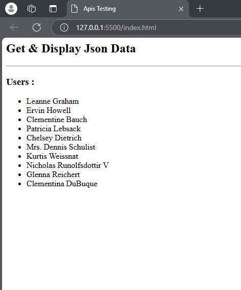

# GET DATA & DISPLAY JSON DATA (API);

### How Script works ? 

- This code makes an API call to fetch a list of users.
- It processes the response, parses it to JSON, and dynamically adds each user's name to a <`ul`> as a list item (`<li>`).
- If any errors occur during the process, they're caught and logged to the console.

<hr>

```javascript

    <script>
  fetch('https://jsonplaceholder.typicode.com/users')
  .then(response => {
    return response.json();
  })
  .then(data => {
    data.forEach(user => {
      const markup = `<li>${user.name}</li>`;
      document.querySelector('ul').insertAdjacentHTML('beforeend', markup);
    });
  })
  .catch(error => {
    console.error('Error:', error);
  });
    </script>
 

```





### Notes  => the learning code: 

Both <strong> await and .then() </strong> are used to handle promises in JavaScript, but they are used in different ways. 
- 

Here’s a breakdown of the differences between them:

### Syntax Style:
- await: Is used inside an async function and makes the code look synchronous (more readable).

- .then(): Is used in promise chains, making the code look more nested and slightly harder to read.

### InsertAdjacentHTML and beforeend
``` document.querySelector('ul').insertAdjacentHTML('beforeend', markup):```

      
    - The document.querySelector('ul') selects the first <ul> element in the document.

    - insertAdjacentHTML('beforeend', markup) inserts the newly created list item (markup) as the last child of the <ul> element.

    - This adds each user's name to the end of the list.
